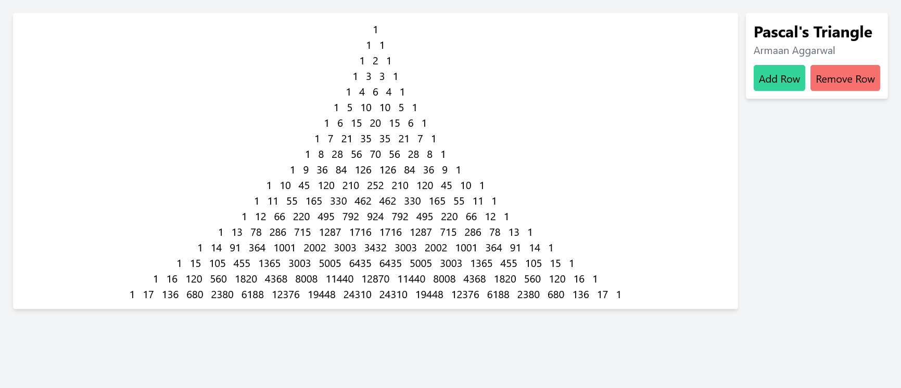

# Pascal's Triangle in React
[](https://github.com/prettier/prettier)

### ❓ Why does this exist?
I was bored so I recreated Pascal's triangle in React just for fun. I did not look up any implementations of Pascal's triangle in JavaScript before making this, the logic is all of my own. I made this in around an hour. This also is definitely not the most efficient JavaScript Pascal's triangle implementation, far from it ;)

As for dependencies, it just uses React, TailwindCSS and I used Vite as my development environment. I also used a `useList` hook from [`react-use`](https://github.com/streamich/react-use).

The code isn't exactly beautiful, as I made this under an hour I didn't bother commenting or making the code look too clean. The user interface itself works, but there may be some CSS edgecases that haven't been properly implemented (example: overflow handling). Maybe one day I'll document the code but probably not.

### 📷 Screenshot


### 🚀 Getting Started
1. 
    Clone the repository
    ```
    git clone https://github.com/Armster15/react-pascal-triangle
    ```

2. 
    Install dependencies
    ```
    cd react-pascal-triangle && npm install
    ```

3. 
    Start the development server
    ```
    npm run start
    ```